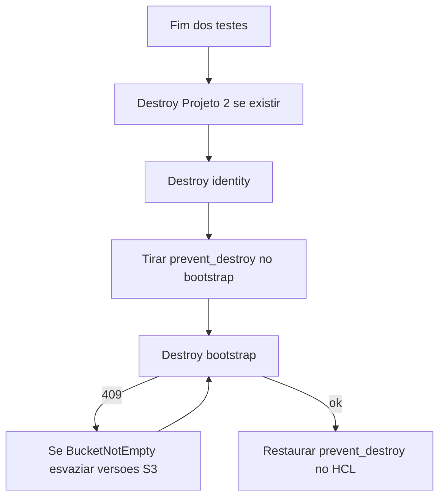

# InfraRoles Mini — Camada de Identidade (Data Mesh POC)

> **Para que serve:** metade **identidade** do mesh — cria as roles IAM (Glue + Analytics) que o
> Projeto 2 consome. Sozinho não faz nada útil; é a fundação de acesso sobre a qual a plataforma
> de dados (`ia-dlc-datamesh-platform-poc`) aplica a governança. Os dois juntos formam o mesh.

Terraform IAM para o **Projeto 1**: execution role Glue + role Analytics. Entrega ARNs ao Projeto 2. Não cria buckets, jobs, workgroup nem role de Acesso.

## Layout do repositório

| Pasta / arquivo | Uso |
|-----------------|-----|
| `identity/` | Root Terraform das roles Glue + Analytics (`env/*.tfvars`, `env/*.backend.hcl`) |
| `bootstrap/` | Backend S3 + lock + OIDC GitHub (uma vez por conta; state local) |
| `tests/` | Simulate IAM (`.ps1` local, `.sh` no CI) — rodar **a partir de** `identity/` |
| `.github/workflows/` | Pipelines `deploy-dev` / `deploy-hom` / `deploy-prod` |
| README **Rotina de trabalho** | Subir no início do dia e destruir no fim do sinal |
| `aidlc-docs/` | Trilha AI-DLC. `archive/poc-v1/` = docs da geração anterior |
| `.aidlc-rule-details/` | Regras do workflow Cursor — não apagar |

## O que cria e para quem serve

Este repo **produz** duas roles; ele não consome ARNs de fora. Nomes padrão
`{project_prefix}-{environment}-glue-role` / `-analytics-role` (default `datamesh-poc-dev-…`).

| Role criada | Quem assume | Permissão IAM (este repo) |
|-------------|-------------|---------------------------|
| Glue | Serviço Glue (`glue.amazonaws.com` + `aws:SourceAccount`) | R/W/list nas três camadas (`sor`, `sot`, `spec`); **sem** `DeleteObject`. Catálogo: Get + partições (schema é IaC do Projeto 2). O fluxo “lê SOR, grava SOT/SPEC” é do job no Projeto 2, não desta policy. |
| Analytics | ARNs em `analytics_principal_arns` | List/read nas camadas; R/W **somente** no bucket de resultados Athena; Athena só no `athena_workgroup`. |

Entradas: `analytics_principal_arns` (**quem** assume a Analytics; tem de ser da **mesma conta** — o `plan` avisa se não for) e os nomes de buckets/workgroup (para **escopar** as policies — os recursos nascem no Projeto 2).

Saídas (contrato com o Projeto 2): `glue_role_arn`, `analytics_role_arn`, `access_role_arn` (sempre `null`). Confira com `terraform output` após o apply.

## Requisitos

- Terraform >= 1.7.5 (CI usa 1.9.8)
- AWS Provider ~> 5.0
- Credenciais AWS na default chain (apply local) ou OIDC (GitHub Actions)
- Conta com permissão para criar IAM roles/policies (local) ou a deploy role da U2 (CI)

## Passo a passo

Um push **não** aplica os três ambientes. Cada ambiente é **uma conta AWS**, **um state**, **uma pipeline**. Comece por **dev**; hom e prod são o mesmo roteiro com conta, branch e arquivos diferentes.

| Ambiente | Conta AWS | Branch que dispara o CI | Arquivos | Apply |
|----------|-----------|-------------------------|----------|--------|
| **dev** | só a de dev | `dev` | `identity/env/dev.tfvars` + `dev.backend.hcl` | automático (um job) |
| **hom** | só a de hom | `hom` (publique no remote **antes**) | `hom.*` | plan → **aprovação** no GitHub Environment → apply |
| **prod** | só a de prod | `main` | `prod.*` | igual ao hom |

O CI aplica só `identity/` (roles Glue + Analytics). O `bootstrap/` **não** entra na pipeline.

### 1. GitHub (uma vez no repositório)

1. Crie GitHub Environments com os nomes **`dev`**, **`hom`** e **`prod`** (iguais ao claim OIDC).
2. Em **hom** e **prod**, ligue required reviewers.
3. Crie variáveis de **repositório** (o job `plan` de hom/prod não tem Environment): `AWS_ROLE_ARN_DEV`, `AWS_ROLE_ARN_HOM`, `AWS_ROLE_ARN_PROD`, `AWS_REGION` (default `sa-east-1` se omitir). Deixe os ARNs vazios até o passo 2.
4. Publique a branch **`hom`** se ainda não existir:

```powershell
git branch hom
git push -u origin hom
```

`workflow_dispatch` não substitui essa branch para o gatilho de push.

### 2. Bootstrap na conta daquele ambiente (uma vez por conta)

Autentique a AWS CLI **nessa** conta (admin). Não use a conta de prod para bootstrap de dev.

```powershell
Set-Location bootstrap
Copy-Item example.tfvars terraform.tfvars
# edite: environment = "dev" (ou hom | prod)
#        github_owner / github_repo = este repositório
terraform init
terraform fmt
terraform validate
terraform plan
terraform apply
terraform output
```

Copie `deploy_role_arn` para a variável GitHub correspondente (`AWS_ROLE_ARN_DEV` se `environment = "dev"`).

Se o nome S3 padrão já existir no mundo, defina `state_bucket_name` no `terraform.tfvars` do bootstrap e **o mesmo** nome em `identity/env/{env}.backend.hcl`. Detalhes e import de OIDC já existente: `bootstrap/README.md`.

Repita este passo nas outras contas quando for subir hom/prod, mudando `environment` e a variável GitHub.

### 3. Preencher os tfvars da identidade

Edite `identity/env/dev.tfvars` (e `hom`/`prod` quando for a vez). Troque os `REPLACE-…` por buckets, workgroup e `analytics_principal_arns` **daquela conta**. O `environment` no arquivo tem de bater com o ambiente (dev/hom/prod).

O `backend.hcl` já aponta para o bucket/tabela convencionais (`datamesh-poc-{env}-tfstate`). Ajuste só se você deu override no bootstrap.

### 4. State local da POC v1 (só se essa conta já teve apply com backend local)

O CI **não** migra. Uma vez, com admin, na conta certa:

```powershell
Set-Location identity
terraform init -backend-config=env/dev.backend.hcl -migrate-state
```

Troque `dev` por `hom` ou `prod` se for o caso. Conta nova: pule este passo.

### 5. Subir a identidade

**Pelo CI (recomendado depois do bootstrap + vars GitHub):**

| Quero | O que faço | O que a pipeline faz |
|-------|------------|----------------------|
| **dev** | push (ou merge) na branch `dev`, ou *Run workflow* em `deploy-dev` | fmt → init → plan → **apply na hora** → simulate, na conta de dev |
| **hom** | push na branch `hom` | job **plan** (sem aprovação) → você revisa o log → aprova o Environment **hom** → job **apply** + simulate |
| **prod** | push na branch `main` | igual ao hom, Environment **prod** |

Hom/prod: o apply re-faz `terraform init` com o **mesmo** `backend.hcl` do plan (runner novo). Artifact `tfplan` dura 1 dia.

**Local (Windows), na conta em que a CLI está autenticada** — sem `-var-file=` no PowerShell:

```powershell
Set-Location identity
Copy-Item env\dev.tfvars terraform.tfvars
# use env\hom.tfvars ou env\prod.tfvars se for outro ambiente
terraform init -backend-config=env/dev.backend.hcl
terraform fmt
terraform validate
terraform plan
terraform apply
terraform output
```

### 6. Conferir

```powershell
Set-Location identity
terraform output
..\tests\simulate-principal-policy.ps1 -SorBucket "datamesh-poc-dev-sor"
```

Use o nome real do bucket SOR daquele ambiente. Se o simulate falhar logo após o apply, espere 10–20 s e repita.

No CI, se der AccessDenied em `iam:SimulatePrincipalPolicy`, acrescente essa action na policy da deploy role no `bootstrap/` e reaplique o bootstrap **nessa conta**.

### 7. Projeto 2

Na **mesma** conta, com os **mesmos** nomes de bucket/workgroup. Identidade pode ir ao ar antes dos buckets existirem.

```
Montar:    este repo (identidade)  →  Projeto 2
Desmontar: Projeto 2 destroy       →  identidade destroy (local)  →  bootstrap por último
```

### 8. Destroy (fim do dia)

Não há destroy nas pipelines. Use o tutorial **Rotina de trabalho** abaixo (identidade primeiro, bootstrap por último).

## Rotina de trabalho (subir e destruir)

Use isto no **início da sessão** (subir para testar) e no **fim do sinal** (destruir para não deixar conta na AWS). O CI **não** destrói nada.

O que cobra nesta POC: bucket S3 de state (versionado) e um pouco de DynamoDB. Roles IAM e OIDC **não** têm custo — mesmo assim destrua o bootstrap no fim do dia, senão o S3 continua.



Texto: Projeto 2 (se houver) → `identity` destroy → tirar `prevent_destroy` → `bootstrap` destroy → se o S3 recusar, apagar versões → restaurar o `lifecycle` no código (não fazer push com a trava desligada).

### Subir (início do dia ou primeira vez)

Credencial **admin** na conta do ambiente (dev neste exemplo). Não use a conta de prod para brincar em dev.

**1. Bootstrap** (se a conta estiver vazia — depois de um destroy do dia anterior você **precisa** disto de novo):

```powershell
Set-Location bootstrap
Copy-Item example.tfvars terraform.tfvars
# environment = "dev"
# github_owner, github_repo, github_owner_id, github_repo_id
terraform init
terraform apply
terraform output
```

Confira se `AWS_ROLE_ARN_DEV` no GitHub ainda é o `deploy_role_arn` (ARN novo se o bootstrap foi recriado).

**2. Identidade** — CI (recomendado) ou local.

CI: push ou *Run workflow* em `deploy-dev` (branch `dev`). Não faça isso **antes** do bootstrap: o OIDC não existe.

Local:

```powershell
Set-Location identity
Copy-Item env\dev.tfvars terraform.tfvars -Force
terraform init "-backend-config=env/dev.backend.hcl"
terraform apply
```

**3. Testes:** `terraform output` e `..\tests\simulate-principal-policy.ps1` a partir de `identity/`.

Hom/prod: o mesmo roteiro com a conta, o `environment` e o `env/*.tfvars` daquele ambiente.

### Destruir (fim dos testes)

Não há `terraform destroy` no GitHub Actions. Tudo local, na conta em que a CLI está autenticada.

**A. Projeto 2** (se estiver aplicado nessa conta): destroy **antes** deste repo.

**B. Identidade** (roles Glue + Analytics):

```powershell
Set-Location identity
Copy-Item env\dev.tfvars terraform.tfvars -Force
terraform init "-backend-config=env/dev.backend.hcl"
terraform destroy
```

Confirme `yes`. Sem isto, o destroy do bootstrap apaga o **state** e as roles ficam órfãs na conta.

**C. Bootstrap** (S3, lock, OIDC, deploy role) — o Terraform recusa enquanto existir `prevent_destroy`.

Em `bootstrap/s3.tf` e `bootstrap/dynamodb.tf`:

- remova o bloco `lifecycle { prevent_destroy = true }`
- no S3: `force_destroy = true`

O `force_destroy` no arquivo **só vale depois de um apply**, ou o destroy falha com `BucketNotEmpty`. Nesta rotina de teardown, o caminho estável é: destroy (apaga IAM/OIDC/DDB), esvaziar versões do bucket, destroy de novo (só o S3).

```powershell
Set-Location bootstrap
terraform destroy
```

Se aparecer `prevent_destroy`, o passo C dos arquivos não foi salvo. Se aparecer **BucketNotEmpty** (bucket versionado), esvazie e destrua de novo:

```powershell
$bucket = "datamesh-poc-dev-tfstate"
$json = aws s3api list-object-versions --bucket $bucket --output json | ConvertFrom-Json
$objects = @()
foreach ($v in @($json.Versions)) { if ($v.Key) { $objects += @{Key=$v.Key; VersionId=$v.VersionId} } }
foreach ($d in @($json.DeleteMarkers)) { if ($d.Key) { $objects += @{Key=$d.Key; VersionId=$d.VersionId} } }
if ($objects.Count -gt 0) {
  $tmp = Join-Path $env:TEMP "tfstate-delete.json"
  @{ Objects = $objects; Quiet = $true } | ConvertTo-Json -Depth 6 | Set-Content $tmp -Encoding ascii
  aws s3api delete-objects --bucket $bucket --delete "file://$tmp"
}
terraform destroy
```

Troque o nome do bucket se o `environment` não for `dev`.

**D. Recoloque** `prevent_destroy = true` e `force_destroy = false` nos dois arquivos. **Não** faça commit/push com a trava desligada (hom/prod perderiam a proteção).

### Depois do destroy: não deixe o CI recriar

Enquanto `origin/dev` existir e alguém der **push** (ou *Re-run*) no `deploy-dev`, o Actions tenta aplicar de novo. Sem bootstrap, o OIDC falha. Com bootstrap ainda no ar, **recria a identidade**. No fim do dia: destroy completo **e** não dispare a pipeline.

### Dia seguinte

Bootstrap apply → conferir variável GitHub do ARN → `deploy-dev` ou apply local da identidade → testar → no fim do sinal, destruir de novo (A→D).

### PR para hom/main neste ritmo (ligar/desligar)

São **três ambientes = três contas AWS = três branches**. Um merge **não** liga os três.

| Ambiente | Branch | Conta AWS | Como sobe a identidade |
|----------|--------|-----------|------------------------|
| dev | `dev` | só a de dev | push / *Run workflow* `deploy-dev` (apply na hora) |
| hom | `hom` | só a de hom | PR `dev` → `hom` **e merge** → `deploy-hom` (plan + **aprovação**) |
| prod | `main` | só a de prod | PR `hom` → `main` **e merge** → `deploy-prod` (plan + **aprovação**) |

No dia a dia de ligar/desligar você escolhe **quantas contas** pagar:

| O que você quer amanhã | O que faz |
|------------------------|-----------|
| Só testar (mais barato) | Liga **só dev**. Sem PR. Destroy dessa conta no fim do sinal. |
| Código nas 3 branches, AWS só em dev | Commit/push na `dev`. PR `dev` → `hom` e `hom` → `main`. No GitHub **cancele** `deploy-hom` / `deploy-prod` (ou não aprove o apply) se essas contas estiverem desligadas. |
| Testar os 3 na AWS | Bootstrap **em cada conta** + variável `AWS_ROLE_ARN_*`. Depois os merges (ou *Run workflow* em cada pipeline). No fim: destroy **em cada conta** que você ligou (identidade, depois bootstrap). |

Abrir o PR **não** sobe nada. O merge sobe **só** a conta daquela branch, se o bootstrap dela existir.

Não use PR para ligar o dev: apply local ou push/`deploy-dev` **depois** do bootstrap dessa conta.

**Atualizar `main`:** isso alinha o **código** de prod, não liga hom nem desliga o destroy de hoje. O merge em `main` dispara `deploy-prod`. Sem bootstrap na conta prod, o plan falha no OIDC — cancele e não aprove o apply.

1. Commit e push na `dev` (README, bootstrap, etc. que ainda estão locais).
2. PR `dev` → `hom` e merge; depois PR `hom` → `main` e merge (passa pelos 3 ambientes no git).
3. Cancele os runs de hom/prod se essas contas AWS estiverem desligadas.
4. Trabalho do dia na conta de **dev**: branch `dev` (`git checkout dev` e `git pull`). Push na `main` = CI de **prod**.

## Pipelines (dev / hom / prod) — referência

Três workflows: `deploy-dev.yml` (branch `dev`, apply automático), `deploy-hom.yml` (branch `hom`, plan depois apply com aprovação), `deploy-prod.yml` (branch `main`). Um push **não** aplica os três ambientes.

### Branch `hom`

A branch remota `hom` é obrigatória para o gatilho de push. Crie e publique **antes** do primeiro uso:

```powershell
git branch hom
git push -u origin hom
```

`workflow_dispatch` não substitui a branch.

### GitHub Environments e variáveis

Crie Environments `dev`, `hom` e `prod` (nomes iguais ao claim OIDC). Em **hom** e **prod**, configure required reviewers.

Variáveis de **repositório** (o job `plan` de hom/prod **não** tem Environment; precisa ler o ARN daqui):

| Variável | Uso |
|----------|-----|
| `AWS_ROLE_ARN_DEV` | Output `deploy_role_arn` do bootstrap na conta dev |
| `AWS_ROLE_ARN_HOM` | idem hom |
| `AWS_ROLE_ARN_PROD` | idem prod |
| `AWS_REGION` | default `sa-east-1` |

O job `apply` (e o job único de `dev`) usa `environment:` para o claim `environment:{env}` e para a aprovação. Sem access keys. Sem `secrets: inherit`.

### Bootstrap (uma vez por conta)

Aplique `bootstrap/` com admin **antes** da primeira pipeline daquela conta. State do bootstrap é local. Ver `bootstrap/README.md`.

Se a conta **já** tinha identidade com backend **local** (POC v1):

```powershell
Set-Location identity
terraform init -backend-config=env/dev.backend.hcl -migrate-state
```

(troque `dev` pelo ambiente). O CI **não** faz migrate. Depois o init remoto usa S3.

Se o OIDC falhar (`Not authorized` / `MalformedPolicyDocument`), a trust precisa de `sub` no formato **com IDs** (`repo:owner@id/repo@id:*`). Preencha `github_owner_id` e `github_repo_id` no bootstrap. Não basta commit/push: reaplique o `bootstrap/` na conta AWS.

## Ir ao ar (local, Windows)

Copie `env/dev.tfvars` (ou hom/prod) para `terraform.tfvars` **dentro de** `identity/`. Não use `-var-file=` no PowerShell.

```powershell
Set-Location identity
Copy-Item env\dev.tfvars terraform.tfvars
# preencha ARNs e nomes de buckets reais da SUA conta

terraform init -backend-config=env/dev.backend.hcl
terraform fmt
terraform validate
terraform plan
terraform apply
terraform output
```

Destroy **não** está nas pipelines. Fim do dia: seção **Rotina de trabalho** (identidade, depois bootstrap).

## Uso (CI)

O CI roda Terraform em `identity/` com `-var-file=env/{env}.tfvars` e `init -backend-config=env/{env}.backend.hcl`. Hom/prod: o job `apply` faz **de novo** `terraform init -input=false -backend-config=` **o mesmo** `backend_path` do plan (runner novo).

Se o simulate no CI falhar com AccessDenied em `iam:SimulatePrincipalPolicy`, acrescente essa action (e `iam:GetContextKeysForPrincipalPolicy` se a API pedir) na customer managed policy da deploy role no `bootstrap/` e reaplique o bootstrap.

## Papéis (quem testa o quê)

| Papel | Quem | O que faz |
|-------|------|-----------|
| Engenheiro | User/role que roda o Terraform | `apply` / `destroy` / `output` deste repo |
| Analista (P2) | ARN em `analytics_principal_arns` | Assume a `analytics-role` (consumo é validado no Projeto 2) |
| Glue Job | Serviço Glue | Assume a `glue-role` (usado pelo job do Projeto 2) |
| Fora do trust | ARN **fora** de `analytics_principal_arns` | **Não** consegue `sts:AssumeRole` na role Analytics — é o teste deste repo |

> "Fora do trust" (deny de **IAM/assume**, testado aqui) ≠ "Não-consumidor LF" (deny de **Lake
> Formation**, testado no Projeto 2). São duas travas diferentes; não confunda os termos entre os repos.

## Validação US-5

Após o apply, a partir de `identity/` (o script lê `terraform output` do diretório atual):

```powershell
Set-Location identity
..\tests\simulate-principal-policy.ps1 -SorBucket "datamesh-poc-dev-sor"
```

Se o simulate falhar imediatamente após o apply, aguarde 10–20 s (eventual consistency do IAM) e repita. Sem SLO.

O **Fora do trust** (ARN fora de `analytics_principal_arns`) não deve conseguir `sts:AssumeRole` na role Analytics.

## Ordem com o Projeto 2

Esta identidade pode ser aplicada **antes** dos buckets existirem. Nomes devem coincidir — ver `aidlc-docs/construction/shared-infrastructure.md`.

```
Montar:    Projeto 1 (este) apply  →  Projeto 2 apply
Desmontar: Projeto 2 destroy        →  Projeto 1 (este) destroy
```

State e `terraform.tfvars` reais não entram no git. Exceções commitadas: `identity/example.tfvars`, `bootstrap/example.tfvars`, `identity/env/*.tfvars`.

## Setup multi-ambiente (bootstrap)

Aplique `bootstrap/` **uma vez por conta AWS** (`dev`, `hom`, `prod`) com credencial admin. Cria o backend (S3 + DynamoDB), o OIDC GitHub e a role de deploy. State do bootstrap é local.

Ver `bootstrap/README.md` (PowerShell: copiar `example.tfvars` → `terraform.tfvars` **dentro de** `bootstrap/`; não usar `-var-file=`).

