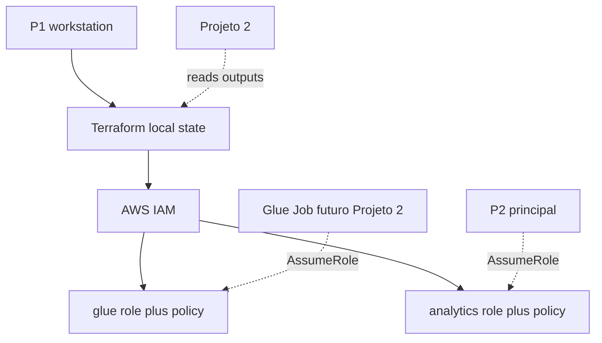

# Deployment Architecture — u1-identity-iam

## Topologia

P1 aplica Terraform **na workstation**, contra **uma conta AWS**. Sem pipeline, sem VPC, sem compute.



## Alternativa em texto

```
P1 (CLI, default credential chain)
    --> terraform apply (state local)
        --> IAM na conta/regiao
            --> glue-role + customer managed policy
            --> analytics-role + customer managed policy
            --> outputs (access_role_arn = null)

Depois (Projeto 2 / runtime, nao criado aqui):
    Glue Job AssumeRole --> glue-role
    Analista AssumeRole --> analytics-role
    Policies referenciam nomes de buckets/workgroup ainda inexistentes
```

## Ciclo

1. Copiar `example.tfvars` → `terraform.tfvars` local (não commitado)
2. `terraform init` / `fmt` / `validate` / `plan` / `apply`
3. `terraform output`
4. `tests/` simulate (espera curta só se IAM inconsistente)
5. `terraform destroy` (não apaga buckets do Projeto 2)

## Isolamento

- Uma unidade, um state, um apply.
- Compartilhamento com Projeto 2: nomes e conta — ver `aidlc-docs/construction/shared-infrastructure.md`.
