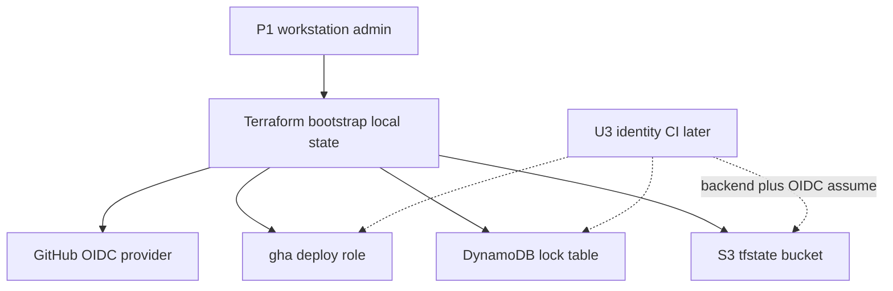

# Deployment Architecture — u2-bootstrap

## Topologia

P1 aplica Terraform **na workstation** (admin), **uma conta por vez**. State do bootstrap é local. Sem pipeline, sem VPC, sem compute.



## Alternativa em texto

```
P1 (CLI, default chain, admin)
    --> terraform apply em bootstrap/ (state local)
        --> S3 {prefix}-{env}-tfstate (prevent_destroy)
        --> DynamoDB {prefix}-{env}-tf-lock (PITR, prevent_destroy)
        --> IAM OIDC GitHub
        --> {prefix}-{env}-gha-deploy-role
        --> outputs para GitHub vars e env/*.backend.hcl

Repetir em conta dev, hom e prod.
U3 nao roda ate este apply existir naquela conta.
```

## Ciclo

1. Copiar `bootstrap/example.tfvars` → `bootstrap/terraform.tfvars` (gitignored)
2. `cd bootstrap`; `terraform init` / `fmt` / `validate` / `plan` / `apply`
3. `terraform output` — copiar nomes/ARN
4. Se OIDC já existir: `import` conforme README
5. Destroy: **não** enquanto U3 usar o bucket; remover `prevent_destroy` no código só de propósito

## Isolamento

- Três applies independentes (três contas).
- Contrato de nomes: `shared-infrastructure.md`.
