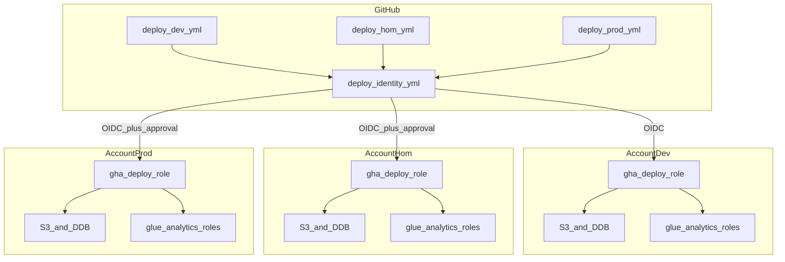

# Deployment Architecture — u3-identity-ci

## Topologia

GitHub.com Actions (runners `ubuntu-latest`) assume a deploy role **da conta do ambiente** (OIDC). Terraform aplica o root de identidade em `identity/`. State remoto = S3 + DynamoDB criados na U2. Sem VPC, sem compute AWS desta unidade.



## Alternativa em texto

```
GitHub callers (deploy-dev / deploy-hom / deploy-prod)
    --> reusable deploy-identity.yml
        --> OIDC assume role da conta do env
        --> terraform init -backend-config=env/{env}.backend.hcl
        --> plan -out=tfplan (-var-file=env/{env}.tfvars)
        --> [hom/prod] artifact 1d + Environment approval + apply tfplan
        --> [dev] apply tfplan no mesmo job
        --> tests/simulate-principal-policy.sh

Local (Windows, admin da conta):
    copy env/{env}.tfvars -> terraform.tfvars
    terraform init -backend-config=env/{env}.backend.hcl
    (uma vez se state local existir: -migrate-state)
```

## Ciclo por ambiente

1. U2 bootstrap na conta (já feito).
2. Criar GitHub Environment `{env}` com `AWS_ROLE_ARN` e `AWS_REGION`; reviewers em hom/prod.
3. Publicar branch `hom` **antes** do primeiro push hom (`origin/hom`).
4. Se a conta já tinha identidade com state **local**: migrate-state com admin **antes** do primeiro CI.
5. Push/dispatch dispara o caller correspondente. Um push **não** aplica os três envs.
6. Destroy da identidade: local/manual, não CI. Não destruir U2 enquanto o state remoto existir.

## Isolamento

- Conta = ambiente; trust OIDC `environment:{env}`.
- Concurrency `identity-{env}` sem cancel.
- State key distinta por env no **próprio** bucket daquela conta.
