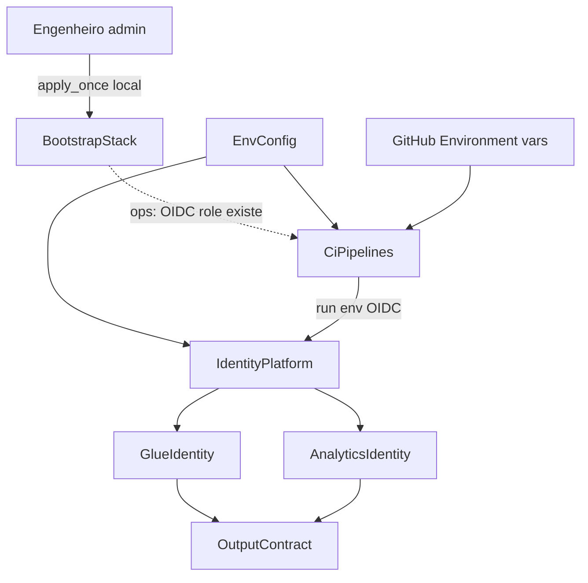

# Component Dependency — Incremento multi-env

## Matriz

| De \\ Para | BootstrapStack | EnvConfig | CiPipelines | GlueIdentity | AnalyticsIdentity | OutputContract |
|------------|----------------|-----------|-------------|--------------|-------------------|----------------|
| BootstrapStack | — | naming opcional | habilita OIDC (ops) | nenhuma no grafo TF | nenhuma | nenhuma |
| EnvConfig | nenhuma | — | lido pelo workflow | lido no apply | lido no apply | indireto (vars) |
| CiPipelines | operacional (role deve existir) | `-var-file` + `-backend-config` | — | após apply | após apply | após apply |
| GlueIdentity | nenhuma (TF) | vars | nenhuma | — | nenhuma | fornece ARN |
| AnalyticsIdentity | nenhuma (TF) | vars | nenhuma | nenhuma | — | fornece ARN |
| OutputContract | nenhuma | nenhuma | nenhuma | lê ARN | lê ARN | — |

**Q4-A:** identity root **não** usa `terraform_remote_state` nem data source do bootstrap. Bucket/tabela/role chegam por EnvConfig + vars GitHub.

**Q7-A:** dois states Terraform independentes; YAML não entra no grafo Terraform.

**POC v1:** Glue ↔ Analytics só por configuração compartilhada.

## Diagrama (Mermaid)



## Alternativa em texto

```
Engenheiro --apply_once--> BootstrapStack (state local, por conta)
                                 |
                                 | operacional (sem remote_state)
                                 v
CiPipelines.run(env) --OIDC + EnvConfig--> IdentityPlatform (state S3 na conta)
                                              |
                                              +--> GlueIdentity
                                              +--> AnalyticsIdentity
                                              +--> OutputContract

Glue e Analytics nao se referenciam.
Simulate.sh e invocado pelo CI; dono = Build and Test.
```

## Fluxo operacional

1. BootstrapService em cada conta.
2. Preencher GitHub Environments (account id, ARN da deploy role) e placeholders de EnvConfig.
3. Criar `origin/hom`.
4. DeployService: `run(dev|hom|prod)` ou apply local.
5. Projeto 2 consome OutputContract **nessa conta**.
