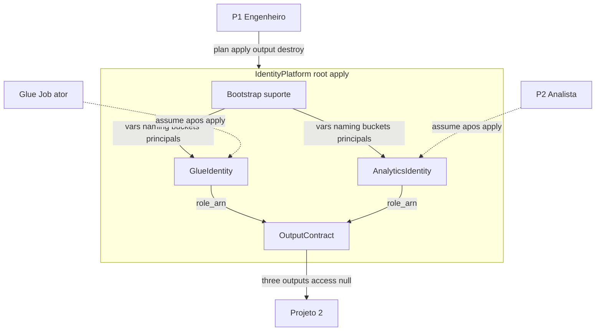

# Component Dependency — InfraRoles Mini

## Matriz

| De \\ Para | GlueIdentity | AnalyticsIdentity | OutputContract | IdentityPlatform (rótulo) |
|------------|--------------|-------------------|----------------|---------------------------|
| GlueIdentity | — | nenhuma | fornece `role_arn` | contido no apply |
| AnalyticsIdentity | nenhuma | — | fornece `role_arn` | contido no apply |
| OutputContract | lê ARN | lê ARN | — | contido no apply |
| Bootstrap (suporte) | vars compartilhadas | vars compartilhadas | — | parte do root |

**Acoplamento Glue ↔ Analytics:** só configuração (mesmos prefixo, environment, nomes de buckets). **Zero** referência IAM de uma role à outra (Q4-A).

**Padrão de comunicação:** composição declarativa no root (mesmo estado Terraform). Sem chamadas runtime entre componentes.

## Diagrama (Mermaid)



## Alternativa em texto

```
P1 Engenheiro --plan/apply/output/destroy--> IdentityPlatform (rotulo do root)

IdentityPlatform contem:
  - Bootstrap (suporte): vars, provider, tags
  - GlueIdentity        (independente de Analytics)
  - AnalyticsIdentity   (independente de Glue)
  - OutputContract      (le role_arn das duas identidades)

OutputContract --glue_role_arn, analytics_role_arn, access_role_arn=null--> Projeto 2

Apos apply: Glue Job assume GlueIdentity; P2 assume AnalyticsIdentity.
US-5 (Nao-consumidor, simulate) fica em Build and Test, fora deste grafo.
```

## Fluxo de dados (resumo)

1. Variáveis entram no root (bootstrap).
2. Cada identidade materializa um `role_arn` independente.
3. O contrato agrega os ARNs e publica `access_role_arn = null`.
4. Projeto 2 consome só o contrato.
