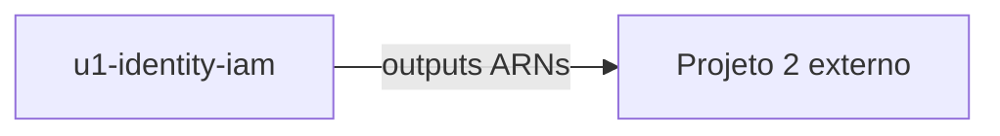

# Unit of Work Dependency — InfraRoles Mini

## Matriz entre unidades

Uma unidade apenas. Sem dependência de outra unidade de trabalho.

| Unidade | Depende de | Bloqueia |
|---------|------------|----------|
| `u1-identity-iam` | — | Projeto 2 (fora deste repositório; consome outputs) |

## Dependências internas (módulos lógicos)

Mesmo grafo do design da aplicação; **não** são unidades de Construction.

| De | Para | Tipo |
|----|------|------|
| OutputContract | GlueIdentity | lê `role_arn` |
| OutputContract | AnalyticsIdentity | lê `role_arn` |
| GlueIdentity | AnalyticsIdentity | nenhuma |
| AnalyticsIdentity | GlueIdentity | nenhuma |
| Ambos | Bootstrap | variáveis compartilhadas |

## Integração

- **Runtime entre unidades:** não há.
- **State:** um arquivo local (fora do git).
- **Contrato externo:** outputs Terraform → Projeto 2.
- **US-5:** verificação na própria unidade (Build and Test), não unidade separada.

## Diagrama (Mermaid)



## Alternativa em texto

```
u1-identity-iam (unica unidade)
    |
    | terraform output
    v
Projeto 2 (consumidor externo, nao e unidade deste repo)
```
