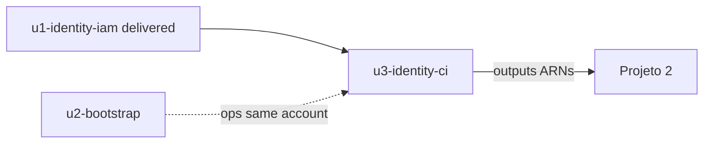

# Unit of Work Dependency — Incremento multi-env

## Matriz entre unidades

| Unidade | Depende de | Bloqueia |
|---------|------------|----------|
| `u1-identity-iam` | — (entregue) | Projeto 2 (outputs); U3 emenda o mesmo root |
| `u2-bootstrap` | — (admin na conta) | U3 apply/CI na **mesma** conta |
| `u3-identity-ci` | U2 **operacional** (OIDC + S3/DDB já existem); código U1 | Projeto 2 por ambiente |

**Não** há `terraform_remote_state` de U3 → U2.

## Ordem

1. Construction U2 completa (código `bootstrap/` no git)
2. Apply U2 em cada conta (fora do CI)
3. Construction U3 (env + workflows + backend no root)
4. `CiPipelines.run(env)` / apply identity

## Integração

- **Runtime entre U2 e U3:** operacional (credencial OIDC + `-backend-config`), não grafo Terraform
- **State:** U2 local em `bootstrap/`; U3 remoto na conta; U1 legado local só até migrar
- **US-5:** Build and Test da U3 (CI chama `.sh`); U1 já tinha o script

## Diagrama (Mermaid)



## Alternativa em texto

```
u1-identity-iam (entregue, .tf na raiz)
        \
         +--> u3-identity-ci (backend + CI + env)
        /
u2-bootstrap --ops (OIDC, S3 state)--> u3-identity-ci

u3 --> Projeto 2 (por conta/ambiente)
```
