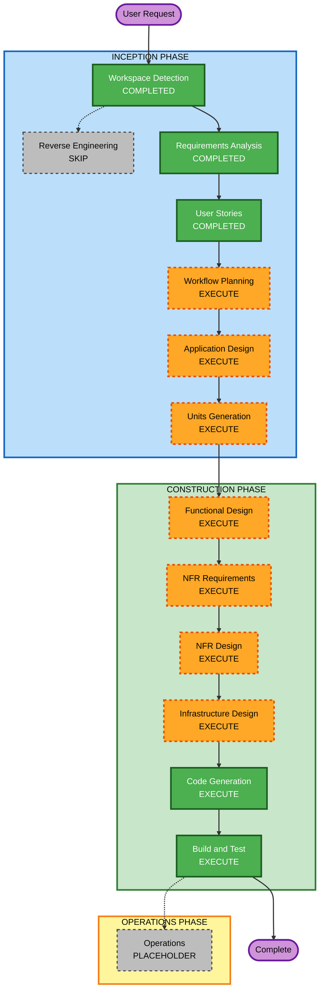

# Execution Plan

## Detailed Analysis Summary

### Transformation Scope (Brownfield Only)
- N/A — projeto Greenfield (sem código de aplicação prévio)

### Change Impact Assessment
- **User-facing changes**: Sim — o engenheiro provisiona/valida/destrói; o analista assume a role de Analytics; Glue Job é ator de aceite
- **Structural changes**: Sim — nova camada de identidade (roles Glue e Analytics + contrato de outputs)
- **Data model changes**: Não — sem schemas de aplicação; apenas variáveis e ARNs
- **API changes**: Sim (contrato) — `terraform output` (`glue_role_arn`, `analytics_role_arn`, `access_role_arn = null`) para o Projeto 2
- **NFR impact**: Sim — menor privilégio (RNF3, RF7), naming, state local, sem segredos no git; sem alvos de performance/HA (extensões Security/Resiliency/PBT desabilitadas)

### Component Relationships (Brownfield Only)
- N/A — Greenfield. Componentes lógicos previstos: bootstrap Terraform, identidade Glue, identidade Analytics, contrato de outputs.

### Risk Assessment
- **Risk Level**: Médio — IAM com menor privilégio; erro de trust/policy quebra ETL ou abre acesso demais; blast radius limitado a uma conta POC
- **Rollback Complexity**: Easy — `terraform destroy` é critério de aceite (US-6)
- **Testing Complexity**: Moderate — `apply`/`output`/`destroy` + `simulate-principal-policy` + controles P2 vs Não-consumidor

## Workflow Visualization

### Mermaid Diagram



### Text Alternative

```
INCEPTION
- Workspace Detection: COMPLETED
- Reverse Engineering: SKIP (greenfield)
- Requirements Analysis: COMPLETED
- User Stories: COMPLETED
- Workflow Planning: EXECUTE (this stage)
- Application Design: EXECUTE
- Units Generation: EXECUTE

CONSTRUCTION (one unit loop)
- Functional Design: EXECUTE
- NFR Requirements: EXECUTE (minimal/standard)
- NFR Design: EXECUTE (minimal)
- Infrastructure Design: EXECUTE
- Code Generation: EXECUTE (always)
- Build and Test: EXECUTE (always)

OPERATIONS
- Operations: PLACEHOLDER
```

## Phases to Execute

### INCEPTION PHASE
- [x] Workspace Detection (COMPLETED)
- [x] Reverse Engineering (SKIPPED — Greenfield, sem código)
- [x] Requirements Analysis (COMPLETED)
- [x] User Stories (COMPLETED — P1/P2, US-1 a US-6, Não-consumidor)
- [x] Execution Plan (IN PROGRESS — awaiting approval)
- [ ] Application Design - EXECUTE
  - **Rationale**: Componentes novos (identidade Glue, identidade Analytics, bootstrap, contrato de outputs). Precisa limites e dependências antes das unidades. Profundidade adaptada a IaC (não camada de serviço HTTP).
- [ ] Units Generation - EXECUTE
  - **Rationale**: IaC greenfield exige mapa história→unidade e organização de código na raiz. Expectativa: **uma unidade** (root Terraform, um `apply`), com arquivos por role já decididos.

### CONSTRUCTION PHASE
- [ ] Functional Design - EXECUTE
  - **Rationale**: Regras de trust, matriz de permissões (sor/sot/spec/Athena) e controles P2 vs Não-consumidor são a lógica de negócio desta POC.
- [ ] NFR Requirements - EXECUTE (profundidade mínima/padrão)
  - **Rationale**: RNFs de segurança e higiene IaC existem (RNF1–RNF8). Stack já indicada no requirements; este estágio confirma e registra decisões. Extensões Security/Resiliency/PBT permanecem N/A.
- [ ] NFR Design - EXECUTE (profundidade mínima)
  - **Rationale**: Só se NFR Requirements executar. Padrões: menor privilégio, justificativa de `Resource *`, gitignore de state/tfvars.
- [ ] Infrastructure Design - EXECUTE
  - **Rationale**: O produto é infraestrutura AWS IAM (região, naming, outputs, backend local).
- [ ] Code Generation - EXECUTE (ALWAYS)
  - **Rationale**: Terraform na raiz do workspace (`glue.tf`, `analytics.tf`, versions/variables/outputs).
- [ ] Build and Test - EXECUTE (ALWAYS)
  - **Rationale**: `validate`/`plan`/`apply`/`output`/`simulate-principal-policy`/`destroy` alinhados a US-5 e US-6.

### OPERATIONS PHASE
- [ ] Operations - PLACEHOLDER
  - **Rationale**: Sem CI/CD, monitoramento ou runbook de produção nesta POC.

## Package Change Sequence (Brownfield Only)
- N/A

## Unidades previstas (rascunho, confirmado na Geração de Unidades)

| Unidade | Escopo | Histórias |
|---------|--------|-----------|
| U1 identity-iam | Root Terraform: bootstrap + Glue + Analytics + outputs | US-1 a US-6 |

Um `apply` único. Sem submódulo (`modules/iam-roles` foi rejeitado).

## Estimated Timeline
- **Total Phases (restantes após este plano)**: 8 a executar (AD, UG, FD, NFRA, NFRD, ID, CG, BT)
- **Estimated Duration**: Sequência linear em uma unidade; profundidade padrão no design funcional/infra e mínima nos NFRs. Sem calendário de sprints neste estágio.

## Success Criteria
- **Primary Goal**: Roles Glue e Analytics reproduzíveis, menor privilégio, contrato de ARNs para o Projeto 2
- **Key Deliverables**: Código Terraform na raiz; outputs `glue_role_arn`, `analytics_role_arn`, `access_role_arn=null`; instruções de build/teste
- **Quality Gates**: apply sem erro; outputs corretos; simulate allow na POC e deny fora; destroy limpo; sem `Resource *` sem justificativa; state/tfvars reais fora do git

## Conformidade com extensões

| Extensão | Status | Justificativa |
|----------|--------|---------------|
| Security Baseline | N/A | Desabilitada; menor privilégio via RF7/RNF3 nos estágios FD/NFR/código |
| Resiliency Baseline | N/A | Desabilitada |
| Property-Based Testing | N/A | Desabilitada |

## Controle do usuário

Este plano é recomendação. Você pode:
- Incluir Engenharia Reversa (não agrega valor: workspace vazio)
- Pular Application Design ou Units (não recomendado: componentes e mapa de histórias ainda não formalizados)
- Pular NFR Requirements/Design (possível, pois a stack já está no requirements; o menor privilégio migraria só para FD + código)
- Pular Infrastructure Design (não recomendado: o entregável é IAM AWS)
