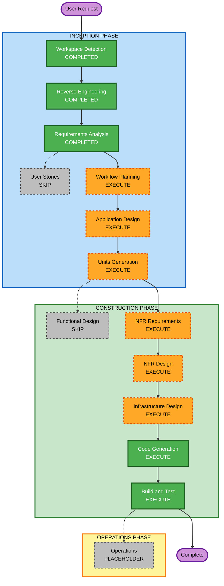

# Execution Plan — Incremento multi-env (dev / hom / prod + CI)

Plano da POC v1 (uma conta, sem CI): `execution-plan-poc-v1.md` (resumo) / git history.

## Detailed Analysis Summary

### Transformation Scope (Brownfield Only)
- **Transformation Type**: Infrastructure + deployment model (não muda Glue/Analytics; muda *como* se aplica)
- **Primary Changes**: Segundo root Terraform (`bootstrap/`); backend S3+DynamoDB no root de identidade; três workflows GitHub Actions; `env/*.tfvars`; validação `environment` in {dev,hom,prod}; README
- **Related Components**: Root IAM existente (`glue.tf`, `analytics.tf`); `tests/*.sh` (CI) e `tests/*.ps1` (local); `.gitignore`

### Change Impact Assessment
- **User-facing changes**: Não (consumidor analista / Glue Job inalterados). Operador passa a usar pipeline + bootstrap.
- **Structural changes**: Sim — dois roots Terraform; state remoto por conta; CI
- **Data model changes**: Não
- **API changes**: Não no contrato de outputs (`glue_role_arn` etc. permanecem). Backend e tfvars mudam o *apply*.
- **NFR impact**: Sim — OIDC sem keys, isolamento de conta, aprovação hom/prod; sem HA/perf (extensões off)

### Component Relationships (Brownfield Only)
- **Primary Component**: identity-iam (root na raiz)
- **Infrastructure Components**: `bootstrap/` (novo); `.github/workflows/` (novo)
- **Shared Components**: `env/*.tfvars`; naming `project_prefix`+`environment`
- **Dependent Components**: Projeto 2 (mesmas três contas; fora deste incremento)
- **Supporting Components**: scripts de simulate; README

| Componente | Tipo de Mudança | Motivo | Prioridade |
|------------|-----------------|--------|------------|
| bootstrap/ | Major (novo) | Backend + OIDC; bloqueia CI | Critical |
| identity root | Minor (backend + validation) | State remoto; env enum | Critical |
| GitHub workflows | Major (novo) | Apply por ambiente | Critical |
| env tfvars + gitignore | Configuration | Valores por conta | Critical |
| tests .sh / .ps1 | Configuration-only | CI chama .sh | Important |
| glue.tf / analytics.tf | Nenhuma lógica nova | Permanece | Optional |

### Risk Assessment
- **Risk Level**: Médio — trust OIDC errado ou apply na conta errada; blast radius = IAM daquela conta
- **Rollback Complexity**: Moderate — destroy do root de identidade por ambiente; bootstrap (OIDC/backend) destroy separado e arriscado se o state já estiver no S3
- **Testing Complexity**: Moderate — validate local + workflows (OIDC só com contas reais); simulate no CI após apply

## Workflow Visualization

### Mermaid Diagram



### Text Alternative

```
INCEPTION
- Workspace Detection: COMPLETED
- Reverse Engineering: COMPLETED
- Requirements Analysis: COMPLETED
- User Stories: SKIP (CI/CD; operador, nao persona de runtime)
- Workflow Planning: EXECUTE (this stage)
- Application Design: EXECUTE
- Units Generation: EXECUTE

CONSTRUCTION
- Functional Design: SKIP (sem nova regra Glue/Analytics)
- NFR Requirements: EXECUTE (OIDC, isolamento, sem keys)
- NFR Design: EXECUTE (padroes OIDC/backend)
- Infrastructure Design: EXECUTE (3 contas, backend, GHA)
- Code Generation: EXECUTE (always)
- Build and Test: EXECUTE (always)

OPERATIONS
- Operations: PLACEHOLDER
```

## Phases to Execute

### INCEPTION PHASE
- [x] Workspace Detection (COMPLETED)
- [x] Reverse Engineering (COMPLETED)
- [x] Requirements Analysis (COMPLETED)
- [x] User Stories (SKIPPED — CI/CD / infra de deploy; sem jornadas novas de Analista/Glue)
- [x] Execution Plan (IN PROGRESS — awaiting approval)
- [ ] Application Design - EXECUTE
  - **Rationale**: Componentes novos (`bootstrap`, workflows, role OIDC, backend) e dependência ovo-e-galinha com o root de identidade. Precisa limites antes das unidades.
- [ ] Units Generation - EXECUTE
  - **Rationale**: Dois roots Terraform + CI. Rascunho: **U2 bootstrap** (por conta, local) depois **U3 identity-ci** (backend no root, tfvars, workflows, README). Confirmado neste estágio.

### CONSTRUCTION PHASE
- [ ] Functional Design - SKIP
  - **Rationale**: RF1–RF7 da identidade não mudam. Trust OIDC e gatilhos são desenho de infra, não regras de negócio de dados.
- [ ] NFR Requirements - EXECUTE (profundidade mínima/padrão)
  - **Rationale**: Novos NFRs: OIDC, least privilege da deploy role, environments GitHub, sem keys. Stack: Actions + AWS provider já conhecido.
- [ ] NFR Design - EXECUTE (profundidade mínima)
  - **Rationale**: Segue NFR Requirements. Padrões: `sub` OIDC restrito, versionamento S3, environments protected.
- [ ] Infrastructure Design - EXECUTE
  - **Rationale**: O incremento *é* infra: S3/DDB, OIDC provider, IAM deploy, GitHub Environments, backend-config.
- [ ] Code Generation - EXECUTE (ALWAYS)
  - **Rationale**: `bootstrap/`, `.github/workflows/`, `env/`, backend no root, `.gitignore`, README.
- [ ] Build and Test - EXECUTE (ALWAYS)
  - **Rationale**: `fmt`/`validate` nos dois roots; instruções de bootstrap + pipeline; simulate `.sh` no CI.

### OPERATIONS PHASE
- [ ] Operations - PLACEHOLDER
  - **Rationale**: Pipelines *são* o entregável de construction; Operations continua placeholder (sem runbook de prod além do README).

## Package Change Sequence (Brownfield)

## Module Update Strategy
- **Update Approach**: Sequential (bootstrap bloqueia o resto)
- **Critical Path**: bootstrap por conta → vars GitHub Environment → identity root + workflows
- **Coordination Points**: nomes de bucket/tabela de state; ARN da deploy role; `environment` no tfvars
- **Testing Checkpoints**: validate bootstrap; validate identity com backend parcial; workflow YAML review

1. **bootstrap/** — Must-update-first (cria OIDC + state)
2. **identity root** (`versions.tf` backend, `variables.tf` validation) — depende do bootstrap
3. **env/*.tfvars + .gitignore** — junto com o root
4. **.github/workflows** — depende da role OIDC e dos tfvars
5. **README + tests** — último (documenta ordem e .sh vs .ps1)

## Unidades previstas (rascunho, confirmado na Geração de Unidades)

| Unidade | Escopo | Dependência |
|---------|--------|-------------|
| U2 bootstrap | Root `bootstrap/`: S3, DynamoDB, OIDC GitHub, deploy role | Nenhuma (admin local) |
| U3 identity-ci | Backend no root IAM, env tfvars, 3 workflows, gitignore, README | U2 aplicado na conta alvo |

Glue/Analytics HCL existente só ganha backend + validation de `environment`; sem reescrever policies.

## Estimated Timeline
- **Total Phases (restantes após este plano)**: 6 a executar (AD, UG, NFRA, NFRD, ID, CG) + BT
- **Estimated Duration**: Sequência linear; duas unidades construction (U2 depois U3). Sem calendário de sprints.

## Success Criteria
- **Primary Goal**: Apply isolado em 3 contas via 3 pipelines OIDC; bootstrap reproduzível
- **Key Deliverables**: `bootstrap/`; workflows deploy-dev/hom/prod; `env/*.tfvars`; backend remoto; README (branch `hom`, var-file local vs CI, .ps1 vs .sh)
- **Quality Gates**: validate nos dois roots; hom/prod com `environment:` protection; CI usa `-var-file` e `.sh`; local documentado sem `-var-file`
- **Integration Testing**: documentar; OIDC real exige contas + repo GitHub
- **Operational Readiness**: README de setup; Operations placeholder

## Conformidade com extensões

| Extensão | Status | Justificativa |
|----------|--------|---------------|
| Security Baseline | N/A | Desabilitada; OIDC + aprovação via RFs |
| Resiliency Baseline | N/A | Desabilitada |
| Property-Based Testing | N/A | Desabilitada |

## Controle do usuário

Você pode:
- Incluir User Stories (operador/aprovador)
- Incluir Functional Design (se quiser formalizar trust OIDC como regra de negócio)
- Pular Application Design ou Units (não recomendado: dois roots + CI ainda não mapeados)
- Pular NFR Requirements/Design (OIDC iria só para Infrastructure Design + código)
- Pular Infrastructure Design (não recomendado: o entregável é AWS + GitHub)
