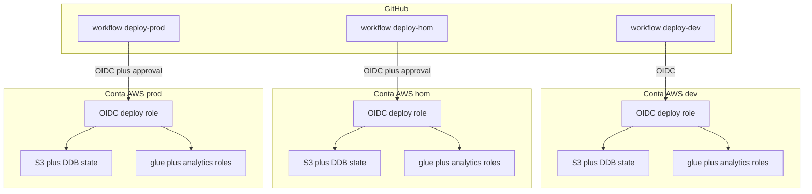

# Requirements — Incremento multi-env (dev / hom / prod + CI)

## Intent Analysis Summary

| Campo | Valor |
|-------|-------|
| Solicitação do usuário | 3 contas AWS fixas (uma por ambiente) e uma pipeline por ambiente para aplicar esta infra |
| Tipo de solicitação | Nova funcionalidade (CI + isolamento por conta) sobre brownfield IAM |
| Clareza | Clara após respostas (Q1–Q13) |
| Estimativa de escopo | Múltiplos componentes (bootstrap, backend, workflows, tfvars, gitignore) |
| Estimativa de complexidade | Moderada |
| Profundidade | Padrão |
| Fonte | Pedido 2026-08-30 + `requirement-verification-questions.md` + RE + POC v1 (`requirements-poc-v1.md`) |

A identidade IAM (roles Glue/Analytics, policies, outputs) **permanece** como na POC v1. Este documento **substitui** os não-objetivos “multi-conta / só dev / state local / sem CI” e **emenda** RNF4 e RNF7.

---

## 1. Visão

Aplicar o **mesmo** root Terraform de identidade em **três contas AWS fixas**, uma por ambiente (`dev`, `hom`, `prod`), via **três pipelines GitHub Actions independentes**. Cada conta é dona do seu state (S3 + DynamoDB) e da sua role de deploy (OIDC). Este repo **não cria contas** Organizations.

**Objetivos**
- **O1.** Um apply isolado por ambiente/conta, sem colidir state.
- **O2.** Pipeline por ambiente: `fmt` + `validate` + `plan` + `apply` + `simulate-principal-policy`.
- **O3.** Autenticação CI sem access keys (GitHub OIDC → IAM role na conta alvo).
- **O4.** Bootstrap versionado (`bootstrap/`) por conta: backend + role OIDC.
- **O5.** Contrato com Projeto 2 **por ambiente na mesma conta**.

**Não-objetivos**
- Criar contas AWS / Organizations / Control Tower
- Terraform Cloud / HCP Terraform
- Um único push aplicando os três ambientes
- Access keys no GitHub
- Implementar o Projeto 2 neste incremento (só o contrato de contas)
- Destroy automatizado nas pipelines (destroy continua local/manual)
- Security Baseline, Resiliency Baseline, PBT (opt-out)

---

## 2. Personas (operação)

- **Engenheiro:** preenche tfvars, aplica bootstrap uma vez por conta (credencial admin), faz push/dispatch das pipelines.
- **Aprovador hom/prod:** revisa o `plan` e aprova o GitHub Environment antes do apply.
- Personas de runtime (Glue Job, Analista) **não mudam** (POC v1).

---

## 3. Decisões fechadas (esclarecimentos)

| Tema | Q | Decisão |
|------|---|---------|
| CI | Q1-A | GitHub Actions; três workflows (um por ambiente) |
| Auth CI | Q2-A | OIDC GitHub → IAM role de deploy **na conta do ambiente**; sem access keys |
| State | Q3-A | S3 + lock DynamoDB **dentro da própria conta** de cada ambiente (Q3 sem letra; texto = A) |
| Bootstrap | Q4-B | Pasta `bootstrap/` aplicada **uma vez por conta** (admin local): bucket + DynamoDB + **provedor OIDC GitHub + role de deploy** |
| Gatilho | Q5-A | Independente. `dev` → conta dev (apply automático). `hom` → conta hom. `main` → conta prod. `workflow_dispatch` em todos. **Nunca** um evento aplica os três |
| Hom | Revisão | Branch `hom` **existe de propósito**, não é opcional. Criar e publicar `origin/hom` **antes** do primeiro uso da pipeline hom por push. `workflow_dispatch` é extra (rodar sem commit novo), **não** substitui a branch. README deve ter o comando de criação. |
| Aprovação | Q6-B | **dev** apply automático após plan ok; **hom** e **prod** exigem aprovação (GitHub Environments) |
| tfvars | Q7-A | `env/dev.tfvars`, `env/hom.tfvars`, `env/prod.tfvars` **commitados** (account IDs, nomes de bucket, ARNs de principal = configuração) |
| Account IDs agora | Q8-B | Placeholders até existirem IDs reais; workflows usam variáveis GitHub (`AWS_ACCOUNT_ID_*` / ARN da role OIDC) |
| Projeto 2 | Q9-A | Mesmas três contas; contrato buckets/workgroup **por ambiente na mesma conta** |
| Jobs CI | Q10-C | `fmt` + `validate` + `plan` + `apply` + simulate |
| Var-file | Revisão | **CI:** `-var-file=env/{env}.tfvars`. **Local (Windows):** sem `-var-file`; copiar o tfvars do ambiente para `terraform.tfvars` gitignored (carregamento automático; evita o parse do PowerShell). |
| Simulate | Revisão | **Manter os dois scripts** (já existem): `tests/simulate-principal-policy.ps1` (workstation Windows) e `tests/simulate-principal-policy.sh` (CI `ubuntu-latest`). Mesmos checks; CI chama **somente** o `.sh`. Sem wrapper único. |
| Extensões | Q11-B, Q12-B, Q13-C | Security **Não**; Resiliency **Não**; PBT **Não** |

**Resolução Q7-A vs Q8-B:** estrutura dos tfvars no git (Q7); valores de account ID podem ser placeholder até preenchimento. Workflows não hardcodam IDs; leem vars/secrets do GitHub Environment.

**Emenda à POC v1 RNF4:** account IDs e ARNs IAM nos tfvars de ambiente **podem** ir para o git. Continua **proibido**: access keys, tokens, state. `.gitignore` deve **permitir** `env/*.tfvars` (hoje ignora `*.tfvars` exceto `example.tfvars`).

---

## 4. Requisitos funcionais (este incremento)

Os RF1–RF7 da POC v1 continuam válidos (roles Glue/Analytics). Acrescenta-se:

### RF-ME1 — Três ambientes / três contas

O root de identidade deve ser aplicável com `environment` em `{dev, hom, prod}` (validação Terraform). Cada apply usa a conta correspondente. Roles continuam nomeadas `{project_prefix}-{environment}-…`.

### RF-ME2 — Backend remoto por conta

O root de identidade deve usar backend S3 + DynamoDB **na conta do ambiente**. Key de state distinta por ambiente (ex.: `datamesh-poc/{environment}/identity.tfstate`). `terraform init` na pipeline com `-backend-config` (bucket, dynamodb_table, region, key) — sem IDs reais obrigatórios no `.tf` até existirem.

### RF-ME3 — Bootstrap uma vez por conta

Deve existir um root `bootstrap/` (state **local**, gitignored) que, aplicado com credencial admin na conta alvo, cria:

- Bucket S3 de state (versionamento; sem acesso público)
- Tabela DynamoDB de lock (`LockID`)
- IAM OIDC provider do GitHub (`token.actions.githubusercontent.com`)
- IAM role de deploy com trust OIDC restrito a este repositório GitHub e ao environment/ref combinado com o ambiente
- Permissões da role: o necessário para o root de identidade (IAM roles/policies desta POC) + leitura/escrita no bucket de state e DynamoDB daquela conta

Bootstrap **não** entra no apply automático das pipelines de identidade (ovo-e-galinha: a role OIDC ainda não existe).

### RF-ME4 — Três workflows independentes

Arquivos (nomes ilustrativos):

- `.github/workflows/deploy-dev.yml` — push em `dev` e `workflow_dispatch`; environment GitHub `dev`; apply **sem** aprovação extra
- `.github/workflows/deploy-hom.yml` — push em `hom` e `workflow_dispatch`; environment `hom`; apply **após** aprovação
- `.github/workflows/deploy-prod.yml` — push em `main` e `workflow_dispatch`; environment `prod`; apply **após** aprovação

A branch remota `hom` é **obrigatória** para o gatilho de push (não é implícita). No setup (README): criar e publicar `origin/hom` **antes** da primeira promoção para hom. `workflow_dispatch` permite rerun sem commit novo; **não** dispensa a existência da branch.

Cada workflow autentica via `aws-actions/configure-aws-credentials` (OIDC), aponta para a role na **sua** conta, e **não** dispara os outros dois.

### RF-ME5 — Sequência de jobs e var-file

Em cada pipeline (CI, runner Linux), após checkout e Terraform:

1. `terraform fmt -check`
2. `terraform init` (backend daquela conta)
3. `terraform validate`
4. `terraform plan -var-file=env/{env}.tfvars`
5. `terraform apply` com o **mesmo** `-var-file` (automático só em **dev**; hom/prod após aprovação do environment)
6. `tests/simulate-principal-policy.sh` (não o `.ps1`) com AWS CLI nativa; bucket SOR do tfvars daquele ambiente

**Local (Windows, POC v1):** não usar `-var-file=` no PowerShell. Copiar `env/dev.tfvars` (ou hom/prod) para `terraform.tfvars` na raiz (gitignored). O Terraform carrega esse arquivo sozinho. Simulate local: `.\tests\simulate-principal-policy.ps1`.

Não há `terraform.tfvars` único versionado para os três ambientes; por isso o CI **precisa** de `-var-file`. Localmente o arquivo único continua sendo o `terraform.tfvars` gitignored.

`destroy` **não** é job das pipelines.


### RF-ME6 — tfvars por ambiente

Commitar `env/dev.tfvars`, `env/hom.tfvars`, `env/prod.tfvars` (placeholders aceitáveis: account/ARNs fictícios no formato válido). Ajustar `.gitignore` para versioná-los.

### RF-ME7 — Isolamento

Pipeline `dev` não pode `assume` da role de `hom` ou `prod` (trust OIDC + environment). State de um ambiente não é usado por outro.

---

## 5. Requisitos não funcionais

- **RNF-ME1.** Terraform `>= 1.7.5`; AWS provider `~> 5.0` (inalterado).
- **RNF-ME2.** Sem access keys no repositório nem em GitHub Secrets para este fluxo (só OIDC).
- **RNF-ME3.** Runners `ubuntu-latest`. Simulate no CI: **só** `tests/simulate-principal-policy.sh`. Workstation Windows: **só** `tests/simulate-principal-policy.ps1`. Os dois arquivos devem permanecer no repo com a **mesma** sequência de `simulate-principal-policy` (Glue GetObject in/out, Analytics GetObject, Analytics PutObject deny). Não unificar num wrapper.
- **RNF-ME4.** State files e `bootstrap/` terraform.tfstate **não** commitados.
- **RNF-ME5.** README deve documentar, sem ambiguidade: (1) criar e publicar a branch `hom`; (2) bootstrap nas 3 contas → GitHub Environments/vars; (3) **local:** `terraform.tfvars` copiado, sem `-var-file=`; **CI:** `-var-file=env/{env}.tfvars`; (4) simulate `.ps1` local vs `.sh` no CI.
- **RNF-ME6.** Tags existentes nas roles de identidade; bootstrap pode taguear bucket/tabela/role de deploy com `Project`, `Environment`, `ManagedBy=terraform`.
- **RNF-ME7.** POC v1 RNF3 (menor privilégio nas policies Glue/Analytics) inalterado.

---

## 6. Modelo lógico



### Alternativa em texto

```
GitHub workflow deploy-dev  --OIDC--> conta DEV  (state S3/DDB + roles IAM)
GitHub workflow deploy-hom  --OIDC + aprovacao--> conta HOM
GitHub workflow deploy-prod --OIDC + aprovacao--> conta PROD

Antes (uma vez, admin local): bootstrap/ em cada conta
  cria bucket, DynamoDB, OIDC provider, deploy role
```

---

## 7. Premissas e restrições

- As três contas **já existem** (ou serão criadas fora deste repo). IDs reais podem permanecer placeholder até o operador preencher tfvars e GitHub vars.
- Branches remotas `dev`, `hom` e `main` existem (criar `hom` no setup se ainda não houver). Hom **não** é “só dispatch sem branch”.
- Bootstrap exige permissão IAM admin (ou equivalente) **na workstation**, não no GitHub, na primeira vez.
- GitHub Environments `dev`, `hom`, `prod` e required reviewers em hom/prod são configuração da UI/API do GitHub (documentar; o YAML referencia `environment:`).
- Projeto 2 não é implementado aqui; nomes de bucket/workgroup nos tfvars devem ser os que o P2 usará **naquela conta**.
- Check `analytics_principals_same_account` permanece: principals de cada tfvars são da **conta daquele ambiente**.

---

## 8. Dependências

- **Entrada:** três contas AWS; repositório GitHub; permissão para criar Environments.
- **Saída:** ARNs Glue/Analytics **por conta** para o Projeto 2 no mesmo ambiente.
- **Ordem:** bootstrap conta N → vars GitHub environment N → pipeline N → (depois) Projeto 2 na conta N.

---

## 9. Critérios de aceite

- `bootstrap/` aplica nas três contas (local) e passa a existir backend + role OIDC.
- Push/`workflow_dispatch` em `dev` aplica identidade na conta dev **sem** aprovação; o job chama `tests/simulate-principal-policy.sh`.
- README instrui criar `origin/hom` **antes** do primeiro deploy hom por push.
- Pipelines hom e prod **não** aplicam até aprovação do environment.
- Push em um branch **não** dispara apply nas outras duas contas.
- CI usa `-var-file=env/{env}.tfvars`; README mostra o caminho local sem `-var-file` (`terraform.tfvars`).
- `terraform init` do root usa state remoto da conta alvo (não state local do root).
- `env/*.tfvars` versionados; state e keys ausentes do git.
- README descreve bootstrap + branch `hom` + var-file local vs CI + `.ps1` vs `.sh`.

---

## 10. Riscos

| Risco | Impacto | Mitigação |
|-------|---------|-----------|
| Bootstrap não feito | Pipeline falha OIDC | README + ordem obrigatória |
| Trust OIDC largo demais (`repo:*`) | Outro workflow assume a role | Restringir `sub` ao repo e ao environment |
| tfvars placeholder no apply | Roles com ARNs fictícios | Documentar preenchimento antes do primeiro apply real |
| Branch `hom` ainda não criada | Push hom nunca dispara; primeira vez “não funciona” | Setup obrigatório no README: criar e publicar `hom`; dispatch não substitui a branch |
| `-var-file` no PowerShell local | `Too many command line arguments` (POC v1) | Local = `terraform.tfvars`; CI (bash) = `-var-file=env/{env}.tfvars` |
| CI chamar o `.ps1` no Ubuntu | Job falha | Workflow chama só `.sh`; `.ps1` fica para Windows |
| Simulate antes dos buckets existirem | Script ainda valida IAM da role vs ARNs de nome | Mesmo padrão POC v1 (nomes no tfvars) |

---

## 11. Conformidade com extensões

| Extensão | Status | Justificativa |
|----------|--------|---------------|
| Security Baseline | N/A (desabilitada) | Q11-B; OIDC + aprovação hom/prod permanecem como RFs |
| Resiliency Baseline | N/A (desabilitada) | Q12-B; versionamento S3 do state é RF-ME2 |
| Property-Based Testing | N/A (desabilitada) | Q13-C; YAML + HCL declarativo |

---

## 12. Rastreabilidade

| Origem | Requisito |
|--------|-----------|
| Pedido 3 contas + pipeline/env | RF-ME1, RF-ME4 |
| Q1-A | RF-ME4 |
| Q2-A | RF-ME3, RF-ME4 |
| Q3-A | RF-ME2 |
| Q4-B | RF-ME3 |
| Q5-A | RF-ME4, RF-ME7 |
| Q6-B | RF-ME4, RF-ME5 |
| Q7-A, Q8-B | RF-ME6 |
| Q9-A | secao 7–8 |
| Q10-C | RF-ME5 |
| Revisão hom / var-file / simulate | RF-ME4, RF-ME5, RNF-ME3, RNF-ME5 |
| POC v1 RF1–RF7 | inalterados neste incremento |
