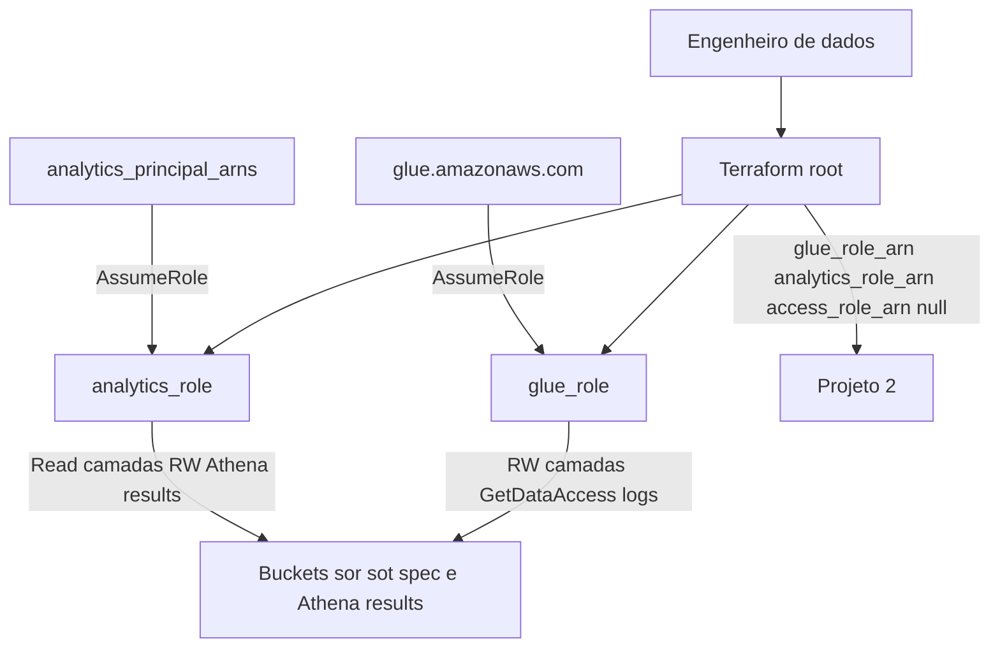

# Requirements — Camada de Identidade (InfraRoles Mini)

## Intent Analysis Summary

| Campo | Valor |
|-------|-------|
| Solicitação do usuário | Inception AI-DLC a partir do PRD de InfraRoles |
| Tipo de solicitação | Novo projeto (greenfield IaC) |
| Estimativa de escopo | Múltiplos componentes (roles Glue e Analytics, policies, outputs) |
| Estimativa de complexidade | Moderada |
| Profundidade | Padrão |
| Fonte | `prd-source.md` (PRD 1.0 POC) + respostas em `requirement-verification-questions.md` |

---

## 1. Visão

Provisionar, via Terraform, a camada de identidade e acesso (IAM Roles e Policies) de uma arquitetura Data Mesh pessoal em **uma única conta AWS**. Este projeto (Projeto 1) entrega os ARNs consumidos pela plataforma de dados (Projeto 2).

**Objetivos**
- **O1.** Roles versionadas e reproduzíveis via IaC.
- **O2.** Menor privilégio, escopado aos recursos da POC.
- **O3.** ARNs como contrato de integração para o Projeto 2.
- **O4.** 100% destruível/recriável (`apply` / `destroy` limpos).

**Não-objetivos**
- Multi-conta
- Roles de ECS, EventBridge ou mainframe
- Ambientes hom/prod (apenas `dev` nesta POC)
- Módulo corporativo `itau-ey4-modulo-iamsr`
- Federação SSO / IdP corporativo
- Rotação de credenciais e políticas de senha
- Criação de buckets, databases Glue, Lake Formation grants ou jobs ETL
- Role de Acesso (automação) nesta iteração — apenas o output contratual

---

## 2. Personas

- **Engenheiro de dados:** aplica e mantém o Terraform; assume a role de Analytics para validar consumo.
- **Glue Job (sistema):** assume a role de Glue para executar ETL.
- **Analista/BI (consumidor):** assume a role de Analytics para consulta via Athena.

---

## 3. Decisões fechadas (esclarecimentos)

| Tema | Decisão |
|------|---------|
| Trust da role Analytics | Lista parametrizada de ARNs (`users` e/ou `roles`) |
| Role de Acesso | Não criar agora; output `access_role_arn` = `null` |
| Região | Variável `aws_region` com default `sa-east-1` |
| Prefixo | `datamesh-poc` (parametrizado; default este valor) |
| Buckets | Este projeto **não cria** buckets; só referencia nomes em policies |
| Camadas | `sor`, `sot`, `spec` (fidelidade Itaú / DBs do Projeto 2) |
| Athena results | Variável `athena_results_bucket`; bucket criado no Projeto 2 |
| Role Glue | Somente execution role (Job/Crawler) |
| State | Backend local; state fora do git |
| Estrutura | Um arquivo por role no root module (`glue.tf`, `analytics.tf`) |
| Extensões | Security Baseline: **Não**; Resiliency: **Não**; PBT: **Não** |

---

## 4. Requisitos Funcionais

### RF1 — Role de Glue (execution)

O sistema deve criar uma IAM Role de Glue com:
- Trust policy permitindo `sts:AssumeRole` apenas ao serviço `glue.amazonaws.com`
- Nome derivado de `project_prefix` + `environment` (ex.: `datamesh-poc-dev-glue-role`)

### RF2 — Permissões da role de Glue

A role de Glue deve permitir, escopado aos recursos da POC:
- Leitura e escrita nos buckets das camadas `sor`, `sot` e `spec` (objeto e prefixo)
- Operações de catálogo Glue necessárias a um job/crawler em execução (não incluir create/update de jobs, crawlers ou databases)
- `lakeformation:GetDataAccess`
- Escrita de logs do Glue no CloudWatch Logs

### RF3 — Role de Analytics

O sistema deve criar uma IAM Role de Analytics com:
- Trust policy permitindo `sts:AssumeRole` aos ARNs em `analytics_principal_arns` (lista de users e/ou roles da mesma conta)
- Nome derivado de `project_prefix` + `environment` (ex.: `datamesh-poc-dev-analytics-role`)

### RF4 — Permissões da role de Analytics (somente leitura governada)

A role de Analytics deve permitir:
- Leitura no catálogo Glue (Get/List; sem Create/Update/Delete)
- `lakeformation:GetDataAccess`
- Execução e acompanhamento de queries Athena
- Leitura nos buckets `sor`, `sot` e `spec`
- Leitura e escrita **somente** no bucket de resultados do Athena

### RF5 — Contrato de outputs

O sistema deve expor via `terraform output`:
- `glue_role_arn` — ARN da role criada
- `analytics_role_arn` — ARN da role criada
- `access_role_arn` — `null` nesta POC (contrato reservado para o Projeto 2)

### RF6 — Parametrização de recursos referenciados

O sistema deve aceitar como variáveis (sem criar os recursos):
- `sor_bucket`, `sot_bucket`, `spec_bucket`, `athena_results_bucket`
- `project_prefix` (default `datamesh-poc`)
- `environment` (default `dev`)
- `aws_region` (default `sa-east-1`)
- `analytics_principal_arns` (lista; obrigatória e não vazia no apply)

### RF7 — Validação de menor privilégio

Após o apply, deve ser possível executar `aws iam simulate-principal-policy` e confirmar:
- acesso **permitido** aos buckets da POC nas ações previstas por role
- acesso **negado** a buckets fora da POC

---

## 5. Requisitos Não Funcionais

- **RNF1.** Terraform `>= 1.7.5`; AWS Provider `~> 5.0`.
- **RNF2.** Nenhum recurso deprecated.
- **RNF3.** Nenhuma policy com `Resource: "*"` sem justificativa documentada no código (comentário + este documento). Exceções previstas:
  - `lakeformation:GetDataAccess` (API não escopável por recurso de dados)
  - Ações Athena de query execution quando o recurso não for escopável por workgroup nesta POC
  - CloudWatch Logs do Glue, se o ARN do log group ainda não existir; preferir prefixo `/aws-glue/*` quando o provider permitir
- **RNF4.** Segredos, Account IDs reais e ARNs reais de produção não versionados. Variáveis e `tfvars` de exemplo usam placeholders; `*.tfvars` com valores reais fica no `.gitignore`.
- **RNF5.** Nomes parametrizados por `project_prefix` e `environment`.
- **RNF6.** `terraform apply` e `terraform destroy` idempotentes e limpos (sem recursos órfãos criados por este projeto).
- **RNF7.** State local; arquivo de state e backups não commitados.
- **RNF8.** Tags mínimas em roles/policies: `Project`, `Environment`, `ManagedBy=terraform`.

---

## 6. Modelo lógico de identidade

### Diagrama (Mermaid)



### Alternativa em texto

```
Engenheiro
    |
    v
Terraform root (glue.tf, analytics.tf, outputs)
    |
    +--> glue_role      <-- assume -- glue.amazonaws.com
    |         |
    |         +--> R/W buckets sor, sot, spec
    |         +--> Glue catalog (execucao)
    |         +--> lakeformation:GetDataAccess
    |         +--> CloudWatch Logs
    |
    +--> analytics_role <-- assume -- lista de ARNs (users/roles)
    |         |
    |         +--> Read buckets sor, sot, spec
    |         +--> Glue read-only
    |         +--> Athena query
    |         +--> R/W athena_results_bucket
    |
    +--> outputs: glue_role_arn, analytics_role_arn, access_role_arn=null
              |
              v
         Projeto 2 (consumidor)
```

---

## 7. Premissas e restrições

- Conta AWS pessoal com acesso administrativo.
- Ambiente único `dev`; região default `sa-east-1`, ajustável por variável.
- Buckets e workgroup Athena **ainda não existem** neste repositório; policies podem referenciar ARNs de buckets futuros. O apply IAM **não depende** da existência dos buckets.
- Nomes dos buckets neste projeto devem ser os **mesmos** usados no Projeto 2.
- Federação SSO está fora de escopo; trust da Analytics usa ARNs IAM da mesma conta.
- Role de Acesso fica de fora da implementação atual, sem arquivo `access.tf`.

---

## 8. Dependências

- **Entrada:** nenhuma (primeiro projeto da sequência).
- **Saída:** Projeto 2 consome `glue_role_arn` e `analytics_role_arn`. `access_role_arn` permanece `null` até uma iteração futura.

---

## 9. Critérios de aceite

- `terraform apply` conclui sem erro.
- `terraform output` retorna `glue_role_arn` e `analytics_role_arn` preenchidos e `access_role_arn` = `null`.
- `aws iam simulate-principal-policy` confirma acesso permitido nos buckets da POC (ações previstas por role) e negado fora deles.
- `terraform destroy` remove todos os recursos criados por este projeto.
- Nenhuma policy usa `Resource: "*"` sem justificativa documentada.
- State e `*.tfvars` reais não estão no git.

---

## 10. Riscos

| Risco | Impacto | Mitigação |
|-------|---------|-----------|
| Permissões amplas demais | Segurança | Menor privilégio; simulação IAM; revisão no `plan` |
| Nome de bucket divergente do Projeto 2 | Integração quebra | Variáveis explícitas compartilhadas por convenção de nome |
| Trust incorreta impede assume | ETL/consulta não roda | Lista de ARNs testável; `simulate-principal-policy` |
| `GetDataAccess` com Resource `*` | RNF3 | Justificativa documentada (limitação da API LF) |
| Output `access_role_arn` null quebrar Projeto 2 | Integração | Contrato explícito: null até a role existir; Projeto 2 trata opcional |

---

## 11. Conformidade com extensões

| Extensão | Status | Justificativa |
|----------|--------|---------------|
| Security Baseline | N/A (desabilitada) | Opt-out Q11; menor privilégio permanece via RNF3–RNF5 e RF7 |
| Resiliency Baseline | N/A (desabilitada) | Opt-out Q12; POC de IAM sem alvos de disponibilidade |
| Property-Based Testing | N/A (desabilitada) | Opt-out Q13; IaC declarativo sem lógica de negócio |

---

## 12. Rastreabilidade PRD → requisitos

| PRD | Requisito |
|-----|-----------|
| RF1, RF2 | RF1, RF2 |
| RF3, RF4 | RF3, RF4 |
| RF5 | RF5 (refinado: `access_role_arn` null) |
| RNF1–RNF5 | RNF1–RNF5 |
| Questão aberta 1 | RF3 / Q1-C |
| Questão aberta 2 | RF5 / Q2-C |
| Questão aberta 3 | RF6 / Q3-C, Q4-A |
