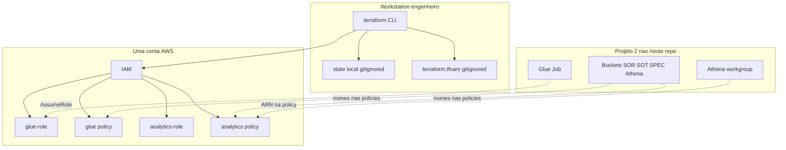
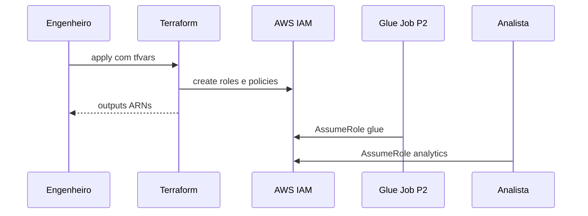

# Arquitetura do Sistema

## Visão Geral do Sistema

Root module Terraform único na raiz do workspace. Cria duas IAM Roles (Glue + Analytics) e duas customer-managed policies na conta/região das credenciais atuais. Não há backend remoto, pipeline, VPC, compute, nem múltiplos ambientes. A variável `environment` só entra no prefixo de nomes (`{project_prefix}-{environment}-...`). State é local e gitignored. Não há CI/CD (nenhum `.github/`, GitLab CI ou CodePipeline).

Limites atuais relevantes para multi-conta / multi-ambiente:

- Um apply = uma conta (provider AWS default chain).
- Check `analytics_principals_same_account` exige que todos os ARNs de trust da Analytics sejam da conta do apply.
- Trust Glue usa `aws:SourceAccount` = conta corrente.
- ARNs de Glue Catalog, Athena workgroup e CloudWatch Logs são da conta/região correntes (`data.aws_caller_identity` / `data.aws_region`).
- Contrato com Projeto 2: mesma conta e região (`shared-infrastructure.md`).

## Diagrama de Arquitetura



### Alternativa em texto

```
Workstation
  terraform apply + state local + tfvars
      --> IAM (uma conta)
          --> glue-role + policy
          --> analytics-role + policy
          --> outputs glue_role_arn, analytics_role_arn, access_role_arn=null

Projeto 2 (externo): buckets, workgroup, Glue Job
  Job AssumeRole --> glue-role
  Analista AssumeRole --> analytics-role
```

## Descrições de Componentes

### IdentityPlatform (root module)

- **Propósito**: Provisionar identidade IAM da POC.
- **Responsabilidades**: Roles, policies, outputs, check de mesma conta para principals Analytics.
- **Dependências**: AWS provider ~> 5.0; nomes de buckets/workgroup (não recursos).
- **Tipo**: Infrastructure (Terraform)

### glue.tf

- **Propósito**: Execution role Glue.
- **Tipo**: Infrastructure

### analytics.tf

- **Propósito**: Role de consumo analítico + check same-account.
- **Tipo**: Infrastructure

### tests/

- **Propósito**: Simulação IAM pós-apply.
- **Tipo**: Test

## Fluxo de Dados



### Alternativa em texto

```
1. Engenheiro: terraform apply
2. IAM: cria roles/policies
3. Outputs: ARNs para Projeto 2
4. Runtime: Glue AssumeRole glue-role; Analista AssumeRole analytics-role
```

## Pontos de Integração

- **APIs Externas**: AWS IAM, STS (assume), Glue/Athena/S3/Logs/Lake Formation apenas como ARNs/ações nas policies (recursos criados no Projeto 2).
- **Bancos de Dados**: nenhum. Catálogo Glue referenciado por ARN de conta.
- **Serviços de Terceiros**: nenhum. Sem GitHub OIDC, sem Terraform Cloud, sem backend S3.

## Componentes de Infraestrutura

- **Stacks CDK**: nenhum
- **Modelo de Implantação**: apply manual na workstation; uma conta; environment default `dev`
- **Rede**: N/A (somente IAM)
