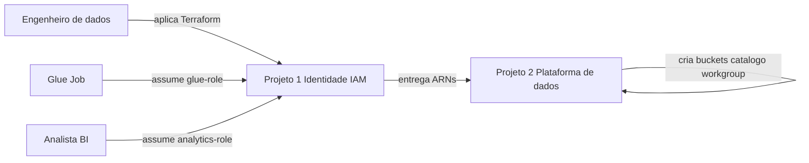

# Visão Geral de Negócio

## Diagrama de Contexto de Negócio



### Alternativa em texto

```
Engenheiro aplica Terraform do Projeto 1
    --> cria glue-role e analytics-role
    --> outputs ARNs para o Projeto 2

Glue Job (Projeto 2) assume glue-role
Analista/BI assume analytics-role
Projeto 2 cria buckets, catalogo Glue, workgroup Athena
```

## Descrição de Negócio

- **Descrição de Negócio**: Camada de identidade (InfraRoles Mini) de um Data Mesh pessoal. Provisiona as IAM Roles que o Glue e os consumidores analíticos usam para acessar as camadas SOR, SOT e SPEC. Sozinho não move dados; é o contrato de acesso sobre o qual o Projeto 2 aplica governança (Lake Formation, jobs, Athena).
- **Transações de Negócio**:
  - **T1 Provisionar identidade**: engenheiro aplica Terraform e obtém ARNs das roles Glue e Analytics.
  - **T2 Executar ETL (runtime Projeto 2)**: Glue Job assume a glue-role para ler/escrever objetos nas camadas (sem DeleteObject) e gerir partições no catálogo.
  - **T3 Consumir dados (runtime Projeto 2)**: analista assume a analytics-role para leitura das camadas, escrita só no bucket de resultados Athena e queries no workgroup parametrizado.
  - **T4 Validar menor privilégio**: simular políticas (ALLOW no recurso da POC, DENY fora; Analytics sem PutObject nas camadas) e confirmar que ARN fora do trust não assume a analytics-role.
  - **T5 Destruir identidade**: `terraform destroy` remove só as roles/policies deste repo; buckets do Projeto 2 permanecem.
- **Dicionário de Negócio**:
  - **Projeto 1**: este repositório — IAM only.
  - **Projeto 2**: plataforma de dados (`ia-dlc-datamesh-platform-poc`) — buckets, Glue, Lake Formation, Athena.
  - **SOR / SOT / SPEC**: camadas de dados referenciadas por nome de bucket; não criadas aqui.
  - **glue-role**: execution role do serviço Glue.
  - **analytics-role**: role assumível por ARNs listados (`analytics_principal_arns`), mesma conta AWS.
  - **access_role_arn**: output contratual sempre `null` nesta POC.
  - **environment**: variável de nome (`dev` por default); um único apply, uma conta, state local.

## Descrições de Negócio no Nível de Componente

### Root Terraform (identity-iam)

- **Propósito**: Materializar as duas roles e policies customer-managed da POC.
- **Responsabilidades**: Trust Glue com `aws:SourceAccount`; trust Analytics com lista de ARNs da mesma conta; policies escopadas a nomes de bucket/workgroup; outputs de contrato.

### Testes de simulação IAM

- **Propósito**: Evidência de menor privilégio (US-5) após o apply.
- **Responsabilidades**: `iam simulate-principal-policy` via AWS CLI (PowerShell e shell).
