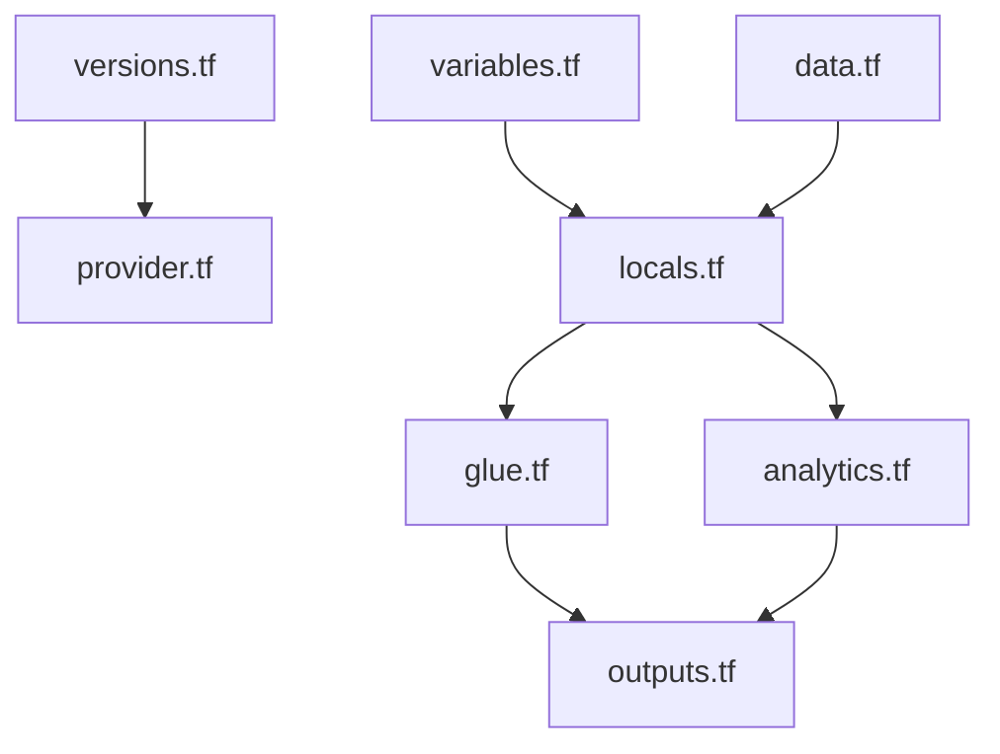

# Estrutura de Código

## Sistema de Build

- **Tipo**: Terraform CLI (>= 1.7.5)
- **Configuração**: `versions.tf` (required_version, aws provider ~> 5.0); `.terraform.lock.hcl` (aws 5.100.0); sem Makefile, sem Terragrunt, sem backend block

## Classes/Módulos Principais



### Alternativa em texto

```
versions.tf + provider.tf
variables.tf + data.tf --> locals.tf --> glue.tf / analytics.tf --> outputs.tf
```

### Inventário de Arquivos Existentes

- `[provider.tf]` - Provider AWS com `region = var.aws_region` (sem assume_role, sem alias por conta)
- `[versions.tf]` - Terraform >= 1.7.5; AWS ~> 5.0; sem `backend` (state local)
- `[variables.tf]` - `project_prefix`, `environment` (default `dev`), `aws_region`, buckets, workgroup, `analytics_principal_arns`
- `[locals.tf]` - Prefixos de nome, ARNs derivados, tags
- `[data.tf]` - `aws_caller_identity.current`, `aws_region.current`
- `[glue.tf]` - Trust Glue + policy + role + attachment
- `[analytics.tf]` - Check same-account + trust + policy + role + attachment
- `[outputs.tf]` - `glue_role_arn`, `analytics_role_arn`, `access_role_arn` (null)
- `[example.tfvars]` - Template commitado (environment = `dev`)
- `[.terraform.lock.hcl]` - Lock provider AWS
- `[.gitignore]` - state, `.terraform/`, `*.tfvars` (exceto example)
- `[tests/simulate-principal-policy.ps1]` - Simulação IAM (Windows)
- `[tests/simulate-principal-policy.sh]` - Simulação IAM (Unix)
- `[README.md]` - Uso local; aviso PowerShell `-var-file`

**Ausente (relevante ao pedido de 3 ambientes / 3 contas / pipeline):**

- Diretórios `envs/` ou `*.tfvars` por ambiente commitados (além do example)
- `backend` S3/DynamoDB ou Terraform Cloud
- Workflow CI (GitHub Actions, GitLab, CodePipeline, Azure DevOps)
- Role de deploy / OIDC por conta
- `provider` com `assume_role`
- Workspaces Terraform ou Terragrunt

## Padrões de Design

### Root module único (não módulo reutilizável)

- **Localização**: raiz
- **Propósito**: POC de uma unidade
- **Implementação**: recursos no root; nomes via `local.name_prefix`

### Parametrização por variáveis (pré-requisito de multi-env)

- **Localização**: `variables.tf` + `locals.tf`
- **Propósito**: `environment` já diferencia nomes se o apply for repetido com tfvars distintos
- **Implementação**: hoje um único default `dev`; sem isolamento de state por ambiente

### Least privilege nas policies

- **Localização**: `glue.tf`, `analytics.tf`
- **Propósito**: escopo a buckets/workgroup/conta
- **Implementação**: ARNs construídos; Glue sem DeleteObject; Analytics read nas camadas

## Dependências Críticas

### hashicorp/aws

- **Versão**: ~> 5.0 (lock 5.100.0)
- **Uso**: IAM roles, policies, policy documents, checks
- **Propósito**: Provisionar identidade AWS
