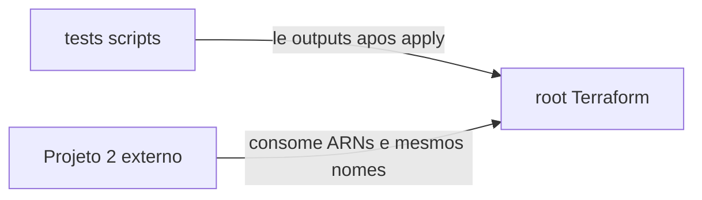

# Dependências

## Dependências Internas



### Alternativa em texto

```
tests/ --> outputs do root (após apply)
Projeto 2 --> glue_role_arn, analytics_role_arn, nomes de bucket/workgroup
```

### tests depende de root Terraform

- **Tipo**: Runtime/Test
- **Motivo**: scripts leem `terraform output` na raiz

### Projeto 2 depende deste root

- **Tipo**: Contrato entre repositórios
- **Motivo**: execution role Glue e role Analytics; mesma conta/região na POC atual

## Dependências Externas

### hashicorp/aws

- **Versão**: ~> 5.0 (locked 5.100.0)
- **Propósito**: Recursos IAM
- **Licença**: MPL-2.0 (provider HashiCorp)

### AWS APIs (conta alvo)

- **Versão**: API AWS da região do apply
- **Propósito**: criar/atualizar/destruir IAM; GetCallerIdentity; simulate-principal-policy
- **Licença**: N/A (serviço cloud)

### AWS CLI (testes)

- **Versão**: qualquer CLI compatível com `iam simulate-principal-policy`
- **Propósito**: validação US-5
- **Licença**: Apache-2.0 (AWS CLI v2)
