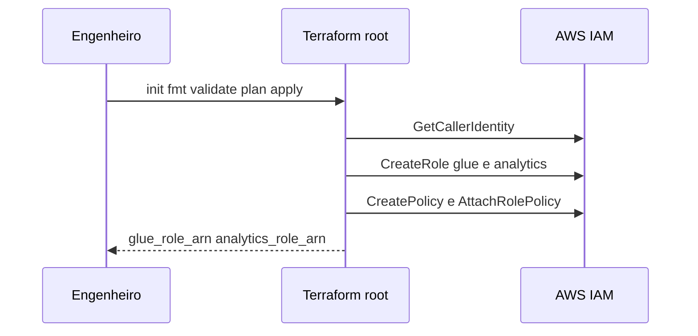
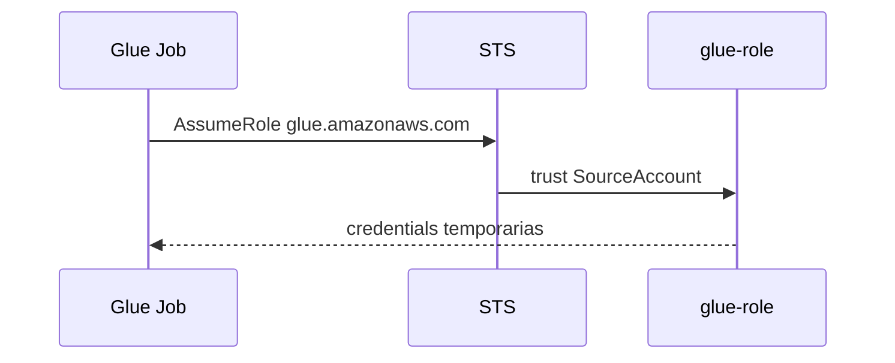
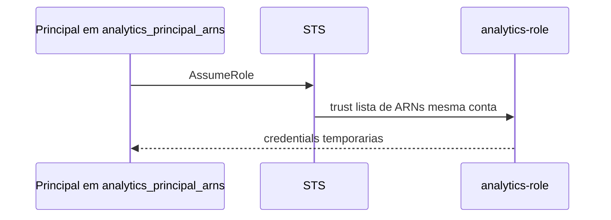
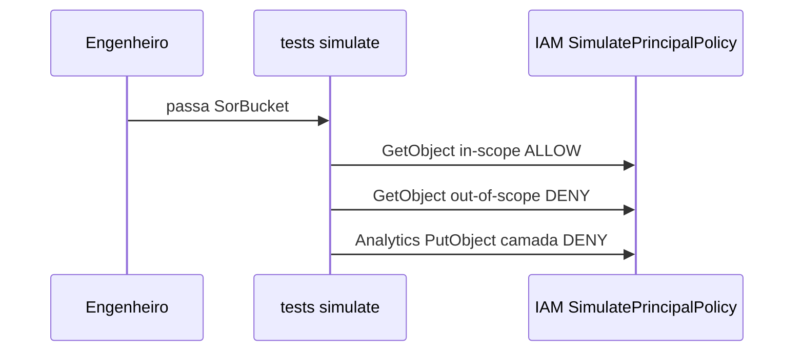
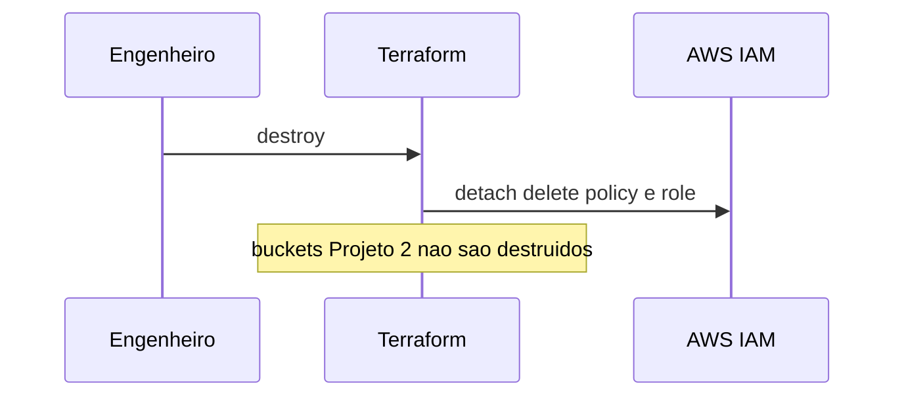

# Diagramas de Interação

Como as transações de negócio são implementadas entre componentes do código atual.

## T1 Provisionar identidade



### Alternativa em texto

```
Engenheiro -> Terraform -> IAM CreateRole/Policy
Engenheiro <- outputs ARNs
```

## T2 Glue Job assume glue-role (runtime Projeto 2)



## T3 Analista assume analytics-role



## T4 Validação menor privilégio



## T5 Destroy


